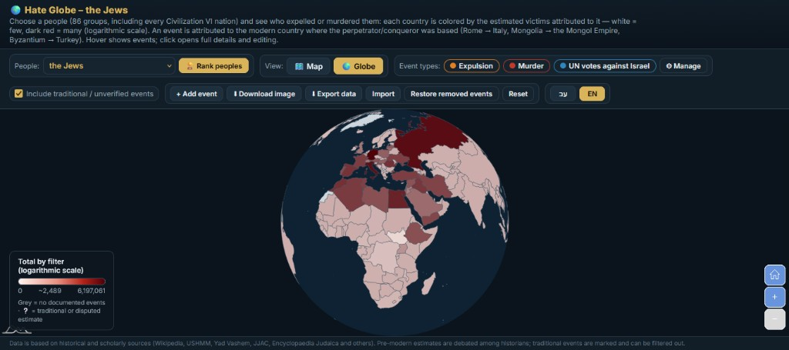

# Hate Globe — גלובוס השנאה

An interactive world map / 3D globe that answers a simple question:

> **For a chosen people, which modern countries are tied to the most expulsions and murders of that people?**

Open **[the live app](https://mkdahan.github.io/hate-globe/)** or download the repo and open `index.html` in a browser. No install, no server, no account.



The app is bilingual (Hebrew ⇄ English). Use the **עב / EN** buttons.

---

## Start here if you are not a historian or a programmer

Think of the globe as a **heatmap of harm attributed to today's countries**.

1. Pick a people in the dropdown (Jews, Armenians, Chinese, Germans, … 86 groups).
2. The map paints each **modern country**.
3. **Grey** = we have no events for that country under the current filters.
4. **White → dark red** = “some harm” → “a lot of harm” on the filters you turned on.
5. Hover a country to see the events. Click it for the full list, numbers, and sources.
6. **Rank peoples** sorts groups by *how many different countries acted against them*, not by who suffered the most deaths.

That last point matters. A people can be devastated by **one** empire and rank lower than a people who were attacked by **many** countries over many centuries. The ranking measures **how widespread the hostility was**, not how deadly any single episode was. The death totals are still shown as a tie-breaker.

---

## The one rule that decides *which country gets the color*

We do **not** color the land where the victims lived.

We color the **modern country of the perpetrator / conquering power**.

Examples:

| Historical actor | Painted as (today) |
| --- | --- |
| Roman Empire | Italy |
| Mongol Empire | Mongolia |
| Timur (Tamerlane), based in Samarkand | Uzbekistan |
| Ottoman Empire / Byzantium | Turkey |
| Soviet Union | Russia |
| Habsburgs | Austria |
| Crown of Aragon expelling Jews from Sicily | Spain |
| Japanese occupation of China / Korea / Indonesia | Japan |

**Why?** The question the map asks is “who did this?”, not “where did the bodies fall?”. If country A conquers country B and kills people in B, the count goes on **A**.

When a people was attacked by its own state (Stalin’s terror against Russians, Khmer Rouge against Cambodians, Franco’s Spain, etc.), that still counts, and it is painted on that same country.

---

## What the numbers on each event mean

Every event is a small record:

| Field | Plain meaning |
| --- | --- |
| **Country (`c`)** | Modern ISO country code of the perpetrator (the coloring rule above). |
| **Type (`t`)** | `expulsion`, `murder`, or `unvotes` (UN votes — Jews only). |
| **`n`** | The number we add into the country’s total: expelled people, or killed people, or (for UN) raw “yes” votes. |
| **`pct`** | UN layer only: share of those resolutions the country voted **yes** on, while it was a UN member. |
| **`v`** | `true` = documented to a normal historical standard. `false` = traditional, legendary, or heavily disputed (e.g. the Exodus). You can hide those with the checkbox. |

If historians disagree (very common before modern censuses), we pick a **mid-range published estimate** and write the range in the note. We do not invent numbers. Disputed items are marked with ❔ / “traditional”.

**Important limitation:** for most peoples this is **not** a complete encyclopedia of every riot. It is the well-known, large, sourced episodes. The Jewish dataset is the densest. Other peoples have the major documented cases. You can add events yourself in the app.

---

## How a country’s color is calculated

### Step 1 — Which events count right now?

Only events that pass **all** of these:

- they belong to the people you selected
- their type is switched **on** (Expulsion / Murder / UN votes / any type you added)
- if you unchecked “include traditional / unverified”, then `v` must be true
- you have not deleted that event

### Step 2 — Add up a number per country

For each remaining event we add one number to that country:

- **Expulsion / murder:** add `n` (the victim estimate).
- **UN votes:** add `pct` (a number from 0 to 100), **not** the raw vote count.

If several types are on at once, we **add those values together**. Mixing “15 million dead” with “83% of UN votes” is a bad mix — the millions swallow the percentage. That is why **UN votes start switched off**. Turn them on **alone** if you want to see the UN heatmap.

### Step 3 — Turn the total into a color (the “spectrum”)

We pick a color between **almost white** `(255, 245, 240)` and **very dark red** `(80, 0, 8)`.

First we compute a slider `t` between 0 and 1, where 0 = the lowest country and 1 = the highest country currently on screen.

**If the highest total is 5,000 or less** (typical for UN *percentages*, which max out at 100):

```
t = countryTotal / maxTotal          ← ordinary “school” proportion
```

Example: 20% vs 100% → `t = 0.20` vs `t = 1.00`. You can actually see the difference.

**If the highest total is bigger than 5,000** (typical for victims: thousands to tens of millions):

```
t = log10(countryTotal + 1) / log10(maxTotal + 1)     ← logarithmic
```

`log10` is “how many digits does this number have?”

| Victims | log10(n+1) roughly | What you should feel |
| --- | --- | --- |
| 9 | ~1 | a little |
| 99 | ~2 | more |
| 999 | ~3 | a lot more |
| 9,999 | ~4 | … |
| 1,000,000 | ~6 | |
| 6,000,000 | ~6.8 | |

**Why logs?** Without them, one Holocaust-sized number (~6 million) would make **everything else look white**. 50,000 dead would be 0.8% of 6 million — almost invisible. On a log scale, 50,000 still shows as a real pink/red, and 6 million is still the darkest. You can compare **orders of magnitude** instead of being blinded by the single worst cell.

Grey vs white:

- **Grey** = no events at all for this country (no data).
- **White** = we *have* events, but the total is ~0 (example: Israel on the UN layer, 0% “yes”).

Then we mix the RGB channels:

```
red   = 255 + (80  - 255) * t
green = 245 + (0   - 245) * t
blue  = 240 + (8   - 240) * t
```

The legend under the map is that same gradient, labeled 0, a midpoint, and the current maximum.

---

## UN votes against Israel (Jews only) — how that layer is built

This layer is **not** guessed. It is generated from the official UN General Assembly voting file (UN Digital Library, voting data v5).

### What counts as an “anti-Israel resolution” here?

A resolution is kept only if **both** are true:

1. Its title/subject is about Israel, Palestinians, the Golan, UNRWA, or Zionism.
2. **Israel itself voted No.**

That second test is the objective filter: we do not sit and judge the politics of each text. If Israel voted against it, it goes in. That produced **1,017** resolutions (1967–2025).

### What we count for each country

For every such resolution, while that country was a UN member:

- **`n`** = how many times it voted **Yes**
- **`m`** = how many of those 1,017 resolutions happened during its membership  
- **`pct` = 100 × n / m**

So a country that joined the UN in 1992 is **not** punished for missing 1967–1991. Malaysia at 100% and a late-joining state at 100% can both be dark red even if their raw `n` differs.

### Historical countries (USSR, Yugoslavia, two Germanys…)

Old UN codes are mapped onto **one** modern country when there is a clear successor (USSR → Russia).  
States that existed **at the same time** as the successor (East Germany vs West Germany, South Yemen vs North Yemen) are **dropped**, so we do not double-count.

The map color for this layer uses **`pct`**, not `n`, so you get a real 0%–100% gradient instead of a blob of identical dark red.

---

## “Rank peoples” — the most-hated list

For each of the 86 peoples we:

1. Take expulsion + murder events (UN votes **do not** count here).
2. List the unique modern country codes on those events.
3. **Rank by how many distinct countries that is.**
4. If two peoples have the same number of countries, the one with the **larger sum of `n`** (victims) goes first.

Toy example:

- People A: murdered by Germany, Russia, Turkey → score **3**
- People B: 10 million dead, but only by one colonial power → score **1**

People A ranks higher. That is intentional: the button is “how many actors went after them”, not “who had the most corpses”.

Click a row to jump to that people’s map.

---

## 86 peoples — what is in the box

| Block | File | What it is |
| --- | --- | --- |
| Jews (default) | `data.js` | Expulsions and murders over ~2,000+ years, plus the UN layer from `data-un.js` |
| Civilization VI nations | `data-civs.js` | The same two event types for each Civ VI people |
| Additional well-documented peoples | `data-peoples.js` | Armenians, Ukrainians, Tutsis, Circassians, Irish, Rohingya, … |

Together that is **86** peoples. Custom events you add in the browser are stored in **your** browser (`localStorage`), not in these files, until you export JSON.

---

## How to run it

1. Download the repo.
2. Double-click `index.html`  
   (or serve the folder with any static server).
3. The map libraries load from the amCharts CDN, so you need internet the first time.

Buttons:

- **Map / Globe** — flat map vs 3D globe (the screenshot above).
- **Download image** — PNG of the current view.
- **Export / Import data** — your extra events and types, as JSON.
- **Add event** — you choose the modern country (perpetrator rule), type, years, and a number.

---

## Honesty box (read this before quoting a color)

- Pre-modern death and expulsion figures are **estimates**. Ancient chroniclers exaggerate; some modern authors do too. Hover the event and read the note.
- “Traditional” (`v: false`) means “this is in cultural memory or a disputed reconstruction”, not “we proved it in a lab”.
- A dark-red country is **not** “this nation is evil forever”. It means: *under the current filters, a large attributed total sits on that modern state*.
- Completeness is uneven. Absence of color is **not** a certificate of innocence; it often means “not in this dataset yet”.
- UN votes are a **diplomatic** record, not bodies. That is why they use a different scale and start off.

Sources used across the datasets include Wikipedia (as a bibliography, not as gospel), USHMM, Yad Vashem, JJAC, Encyclopaedia Judaica, UN Digital Library, IPN, ICTY, UNHCR, OHCHR, and the scholarly works named on each event card.

---

## Project files

| File | Role |
| --- | --- |
| `index.html` | Page, layout, Hebrew/English labels |
| `app.js` | Map, coloring math, ranking, language toggle |
| `data.js` | Jewish events + event-type definitions |
| `data-un.js` | UN vote events (generated from the official CSV) |
| `data-civs.js` | Civilization VI peoples |
| `data-peoples.js` | Extra historical peoples |
| `i18n.js` | UI strings, country names, people names |
| `i18n-events.js` | English titles/notes/sources for built-in events |

The coloring functions live in `app.js`: `visibleEvents()`, `countryColorData()`, `colorForValue()`, `hateRanking()`.

---

## License / use

This is a historical visualization for study and discussion. Treat every number as an estimate with a source card, not as a court verdict.
